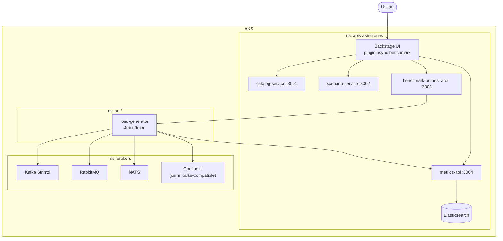

# APIs Asíncrones - Portal de proves

Portal web basat en Backstage per crear, executar i comparar proves
d'APIs asíncrones. El projecte permet provar combinacions de broker,
protocol, arquitectura i format de dades sobre un clúster AKS, i després
veure si el resultat és comparable i defensable.

Projecte de Final de Grau. Universitat de Girona. Marc Font. 2026.

## Què fa el portal

L'app està pensada per respondre preguntes concretes:

1. Quins components puc provar?
2. Quines combinacions es poden executar ara mateix?
3. Com creo un escenari de prova?
4. Què està passant mentre una execució està en marxa?
5. D'on surt la puntuació final d'un resultat?

Les pàgines principals són:

| Pàgina | Funció |
|--------|--------|
| Home | Explica el flux general: escenari, execució, mesures i resultats. |
| Catàleg | Mostra components, compatibilitat i detalls de reproduïbilitat. |
| Escenaris | Crea, edita, duplica i executa escenaris. |
| Execucions | Mostra runs actius, aturats i finalitzats amb detall en directe. |
| Resultats | Compara historial, mètriques i càlcul de puntuació. |
| Settings | Canvia idioma i tema visual. |

El text visible està preparat en català, castellà i anglès.

## Estat funcional

Canvis més recents del portal:

- Guies de pàgina unificades amb el mateix format visual.
- Tutorials propis per Home, Catàleg, Escenaris, Execucions i Resultats, amb pantalla tipus top-nav com el portal real.
- Filtres compartits a Catàleg, Escenaris, Execucions i Resultats.
- Botons coherents entre pàgines, sense degradats i amb `Tutorial` com a etiqueta única.
- Textos reescrits amb llenguatge més curt i directe.
- Catàleg amb estats de compatibilitat més honestos:
  `Es pot executar`, `Requereix configuració` i `No disponible ara`.
- Catàleg sincronitzat amb el seed predefinit encara que Elasticsearch ja
  tingués dades antigues. Això garanteix que també aparegui `SEA`.
- Modal de component amb reproduïbilitat, configuració, versions revisades i condicions de prova.
- Protecció visual contra textos corruptes o massa repetits dins el Catàleg.
- Execucions amb detall estable mentre arriben refrescos.
- Execucions amb resum superior simplificat: la taula i els filtres porten la resta del context.
- Resultats amb `Detall de l'escenari`, missatges més clars quan falten mostres i càlcul de puntuació més traçable.
- Cua d'execucions al `benchmark-orchestrator`: els runs poden quedar `pending`
  abans d'entrar a Kubernetes.
- Resultats en directe separa les execucions en curs de les pendents.
- Documentació final de migració a Azure for Students, costos, nodes i estat de
  l'aplicació.

## Últims commits rellevants

| Commit | Resum |
|--------|-------|
| `6d102a9` | Concreta el tutorial i les guies finals amb passos clicables. |
| `90fb337` | Afegeix SEA visible, quatre presets finals, Resultats més compacte i ajustos Kafka 8K. |
| `ae93b89` | Ajusta cua, estats, UI de resultats, documentació final i `MAX_CONCURRENT_RUNS=3`. |
| `93f8aed` | Afegeix cua de runs i límit de concurrència a l'orquestrador. |
| `9fac4dc` | Millora l'arrencada i reintent de connexió de NATS i RabbitMQ. |
| `e199b72` | Usa el servei estable de NATS per als Jobs de benchmark. |
| `4c48a44` | Fixa els Jobs de càrrega al node `benchmark-role=loadgen`. |
| `583b3a1` | Alinea recursos de brokers per a proves comparables a Azure Students. |
| `190157d` | Simplifica textos del portal, comentaris i etiquetes principals. |
| `a84ae8d` | Unifica guies, filtres, compatibilitat i explicació de puntuació. |
| `01a52ce` | Reordena guies i còpia visible de les pàgines principals. |

## Arquitectura

El sistema viu dins un clúster Azure Kubernetes Service. Els manifests
actuals del repo fan servir el namespace `apis-asincrones` per a l'app i
`brokers` per a Kafka, NATS, RabbitMQ i la resta de brokers. Els Jobs de
benchmark es creen en namespaces efímers `sc-*` per aïllar cada execució.
La comparació justa no depèn del namespace, sinó de recursos fixos,
warm-up, perfils de càrrega iguals i control de concurrència. Per a demo el
cluster usa `MAX_CONCURRENT_RUNS=3`; per a mesures estrictes de memòria es pot
baixar temporalment a `1`.



Flux d'una prova:

1. L'usuari crea o tria un escenari.
2. El portal envia la petició al backend de Backstage.
3. El backend fa proxy cap al `benchmark-orchestrator`.
4. L'orquestrador deixa el run en `pending` si el límit de concurrència està ple.
5. Quan hi ha espai, crea un namespace efímer `sc-*` i un Job de Kubernetes amb el `load-generator`.
6. El generador envia missatges al broker triat i puja mesures a `metrics-api`.
7. `metrics-api` desa les mostres a Elasticsearch i les mostra al portal.

Estats operatius:

| Estat | Lectura |
|-------|---------|
| `pending` | El run espera torn. Encara no ha creat Job ni mètriques. |
| `running` | El Job existeix i publica snapshots cada 5 segons. |
| `completed` | La prova ha acabat i la mostra final s'ha guardat. |
| `failed` | Ha fallat broker, endpoint o generador de càrrega. |
| `cancelled` | L'usuari ha aturat el run. |

Escenaris finals de mostra:

| Cas | Preset |
|-----|--------|
| IoT | `NATS telemetria IoT` |
| Financer | `RabbitMQ financer fiable` |
| Kafka | `Kafka vídeo 4K log-centric` |
| Confluent | `Confluent vídeo 4K Kafka-compatible` |

## Estructura del repositori

```text
apis-asincrones/
├── packages/
│   ├── app/                        # Frontend Backstage
│   ├── backend/                    # Backend Backstage i proxy
│   ├── catalog-service/            # Catàleg de components
│   ├── scenario-service/           # CRUD d'escenaris
│   ├── benchmark-orchestrator/     # Crea Jobs de Kubernetes
│   ├── load-generator/             # Envia càrrega al broker
│   └── metrics-api/                # REST + WebSocket de mètriques
├── plugins/
│   └── async-benchmark/            # Plugin visible del portal
├── k8s/                            # Manifests AKS
├── docs/                           # Documentació tècnica
├── scripts/                        # Scripts auxiliars
├── deploy-all.sh                   # Build, push i restart a AKS
└── app-config.yaml                 # Configuració Backstage local
```

## Stack

| Capa | Tecnologia |
|------|------------|
| Portal | Backstage 1.47, React 18, TypeScript |
| Paquets | Yarn 4 |
| Backend | Node.js i Express als microserveis |
| Dades | Elasticsearch |
| Cluster | Azure Kubernetes Service |
| Brokers | Kafka, Confluent, RabbitMQ, NATS |
| Observabilitat | Metrics API, WebSocket i Grafana |

No s'han afegit dependències noves per als canvis recents de UI.

## Engegada en local

Prerequisits:

- Node.js 22 o 24.
- Corepack habilitat per usar Yarn 4.
- Git.
- Opcional: `kubectl` si vols executar proves reals contra AKS.

```bash
corepack enable
corepack yarn install --immutable
corepack yarn start
```

Serveis locals principals:

| Servei | URL |
|--------|-----|
| Frontend | http://localhost:3000 |
| Backend Backstage | http://localhost:7007 |

Per navegar pel portal: Home, Catàleg, Escenaris, Execucions, Resultats i
Settings.

## Comandes de validació

```bash
npx tsc --noEmit
corepack yarn lint:all
corepack yarn build:all
```

Notes:

- `corepack yarn lint` només revisa canvis contra `origin/master`.
- `corepack yarn lint:all` és la revisió completa del monorepo.
- `corepack yarn install --immutable` ha de passar sense tocar lockfiles.

## Compatibilitat i reproduïbilitat

El portal no ha de marcar una combinació com a bona si el sistema actual
no la pot provar correctament. Per això es fan servir tres estats:

| Estat | Significat |
|-------|------------|
| Es pot executar | La combinació encaixa amb el camí implementat. |
| Requereix configuració | Pot funcionar, però cal ajustar el broker o el format. |
| No disponible ara | No hi ha gateway o camí implementat en aquesta fase. |

Reproduïbilitat vol dir poder repetir una prova amb les mateixes
condicions i obtenir resultats comparables. Per això el catàleg explica
versió, configuració, limitacions, variables que cal fixar i lectura del
resultat.

Nota important sobre `Confluent`: dins del portal és una plataforma pròpia,
però en aquesta fase s'executa pel camí Kafka-compatible del clúster. Això
vol dir que la prova mesura publish/consume amb protocol Kafka i no serveis
addicionals de Confluent com Schema Registry, ksqlDB o Control Center. Abans
de defensar una versió concreta, cal verificar la imatge desplegada al clúster.

## Resultats i puntuació

El detall d'un resultat mostra:

- configuració de l'escenari;
- estat final;
- mètriques disponibles;
- avisos si falten dades;
- càlcul de puntuació.

La puntuació es presenta amb una fórmula llegible:

```text
valor convertit x pes = punts aportats
```

Després es mostra la suma abans de descomptes, els descomptes per errors
o pèrdua de missatges, i la puntuació final.

## Execucions aturades i mesures que falten

Una execució pendent encara no ha creat Job de Kubernetes i no ha de tenir
mètriques. Una execució aturada no es reprèn automàticament en aquesta fase. Pot
conservar dades parcials si el generador ja havia enviat mostres a
`metrics-api`. Si no hi ha dades, la UI ha d'explicar si encara no han
arribat, si l'execució ha fallat o si s'ha aturat massa aviat.

El `load-generator` envia una primera mostra de diagnosi quan arrenca,
snapshots cada 5 segons i una mostra final quan acaba o rep senyal
d'aturada. Si el broker no existeix o no te endpoints llestos,
l'orquestrador marca el run com a fallit i envia una mostra amb
`errorCode=BROKER_NOT_READY`; aixi Resultats no queda en blanc.

`metrics-api` prepara l'índex `async-metrics` en arrencar i també ho
torna a intentar abans del primer `POST /metrics` si Elasticsearch encara
no estava llest. Això fa més robusta la recollida de les primeres mostres.

## Desplegament a AKS

Aplicacio base:

```bash
kubectl create namespace apis-asincrones --dry-run=client -o yaml | kubectl apply -f -
kubectl create namespace brokers --dry-run=client -o yaml | kubectl apply -f -

kubectl apply -f k8s/storage/
kubectl apply -f k8s/deployments/
kubectl apply -f k8s/services/
kubectl apply -f k8s/rbac/
kubectl apply -f k8s/brokers/

kubectl apply -f 'https://strimzi.io/install/latest?namespace=brokers' -n brokers
kubectl wait deployment/strimzi-cluster-operator -n brokers --for=condition=Available --timeout=300s
kubectl apply -f k8s/kafka/
kubectl get pods,svc,endpoints -n brokers
```

Build, push i restart:

```bash
./deploy-all.sh
bash scripts/configure-backstage-public-url.sh
```

Si Azure for Students bloqueja `az acr build` amb `TasksOperationsNotAllowed`,
usar el workflow manual de GitHub Actions `Build ACR images` i després fer:

```bash
./deploy-all.sh --restart-only
```

El desplegament públic recomanat és AKS amb ingress nginx i cert-manager.
Vercel queda descartat per aquest projecte: el backend necessita processos
persistents, Jobs de Kubernetes i connexió amb brokers stateful.

## Documentació addicional

- [`docs/architecture.md`](docs/architecture.md): arquitectura i flux.
- [`plugins/README.md`](plugins/README.md): plugin Backstage.
- [`plugins/async-benchmark/README.md`](plugins/async-benchmark/README.md): UI del benchmark.
- [`packages/README.md`](packages/README.md): microserveis.
- [`k8s/README.md`](k8s/README.md): manifests Kubernetes.

## Autoria

| Persona | Rol |
|---------|-----|
| Marc Font | Estudiant i autor |
| Jerónimo Hernández González | Tutor UdG |
| David Teres Carrillo | Tutor empresa |

Llicència: repositori acadèmic sense llicència pública definida. Qualsevol
reutilització fora del PFG s'hauria d'autoritzar explícitament amb l'autor i
els tutors.
