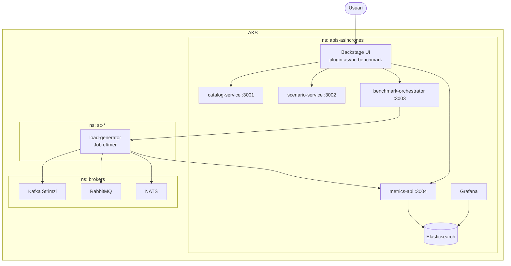

# APIs Asíncrones - Portal de proves

Portal web basat en Backstage per crear, executar i comparar proves d'APIs asíncrones sobre Azure Kubernetes Service. El projecte permet definir escenaris amb una arquitectura, un protocol, una plataforma de missatgeria i un format de dades, executar-los com a Jobs de Kubernetes i consultar-ne els resultats amb mètriques persistides.

Projecte de Final de Grau. Universitat de Girona. Marc Font. 2026.

## Objectiu

L'objectiu no és només desplegar brokers, sinó oferir una eina reproduïble per comparar combinacions d'arquitectura, protocol, plataforma i càrrega amb dades defensables. Per això el portal controla la configuració de cada escenari, separa les execucions pendents de les que realment estan corrent i desa les mostres a Elasticsearch per poder comparar-les després.

La idea central és que una decisió arquitectònica no es prengui només per teoria o preferència tecnològica, sinó a partir de proves equivalents: mateix format de dades, mateixa durada, mateix ritme, mateix payload i mateixa manera de recollir mètriques.

## Lectura ràpida del repositori

Aquest projecte està dividit en quatre blocs principals:

| Bloc | Funció |
|---|---|
| `plugins/async-benchmark` | Part visual del portal Backstage: pàgines, components, filtres, guies i resultats. |
| `packages/` | Serveis executables: Backstage, orquestrador, generador de càrrega, mètriques, catàleg i escenaris. |
| `k8s/` | Manifests de Kubernetes per desplegar el portal, brokers, serveis, storage i permisos. |
| `docs/` | Documentació tècnica principal del projecte. |

## Fitxers principals de l'arrel

| Fitxer | Funció |
|---|---|
| `app-config.yaml` | Configuració local de Backstage. Defineix el proxy cap als microserveis interns: `catalog-service`, `scenario-service`, `benchmark-orchestrator` i `metrics-api`. |
| `app-config.production.yaml` | Configuració equivalent per a l'entorn desplegat. Ajusta URL pública, CORS i endpoints interns del clúster. |
| `backstage.json` | Metadades de l'aplicació Backstage. |
| `catalog-info.yaml` | Descriptor perquè Backstage pugui registrar el projecte dins del seu catàleg. |
| `Dockerfile` | Imatge base del portal quan es construeix el projecte complet. |
| `package.json` | Scripts i dependències del monorepo. |
| `playwright.config.ts` | Configuració de proves end-to-end del frontend. |
| `resultats-finals-10min.json` | Export dels resultats finals en format JSON. |
| `resultats-finals-10min.csv` | Export dels resultats finals en format CSV. |
| `tsconfig.json` | Configuració TypeScript general. |
| `yarn.lock` | Bloqueig de versions de dependències per mantenir instal·lacions reproduïbles. |

## Què fa el portal

| Pàgina | Funció |
|---|---|
| Home | Dona context: què és un broker, com circulen els missatges i com s'usa el portal. |
| Catàleg | Mostra arquitectures, protocols i plataformes, amb compatibilitat i reproduïbilitat. |
| Escenaris | Permet crear, editar, duplicar, executar i aturar escenaris. |
| Execucions | Mostra l'estat dels runs: pendent, en execució, completat, fallit o cancel·lat. |
| Resultats | Compara mètriques històriques, puntuació i detall de cada run. |
| Settings | Canvia idioma i tema visual. |

El text visible està preparat en català, castellà i anglès.

## Arquitectura

El sistema viu dins un clúster AKS. Els serveis del portal es despleguen al namespace `apis-asincrones`, els brokers al namespace `brokers` i cada prova crea un namespace efímer `sc-*`. Aquesta separació ajuda a veure i netejar cada execució, però la comparació justa depèn sobretot de mantenir constants el payload, la durada, el ritme d'enviament, el warm-up, els recursos i la concurrència.



## Flux d'una prova

1. L'usuari crea o tria un escenari a la pàgina `Escenaris`.
2. El modal d'execució construeix la configuració efectiva del run.
3. El frontend fa un `POST /runs` contra el proxy de Backstage.
4. Backstage redirigeix la crida cap al servei intern `benchmark-orchestrator`.
5. L'orquestrador crea un `runId`, registra el run i el posa a la cua.
6. Quan la concurrència ho permet, l'orquestrador crea un namespace `sc-*` i un Job de Kubernetes.
7. El Job executa la imatge `load-generator:latest`.
8. El generador publica i consumeix missatges al broker triat: Kafka, Confluent, NATS o RabbitMQ.
9. El generador envia snapshots a `metrics-api` cada 5 segons.
10. `metrics-api` desa les mostres a Elasticsearch.
11. La pàgina `Resultats` i Grafana llegeixen les dades guardades.

El frontend no parla directament amb Kubernetes. La responsabilitat de crear namespaces, Jobs, selectors de node i variables d'entorn és del `benchmark-orchestrator`.

## Estructura del repositori

```text
apis-asincrones/
|-- docs/
|   `-- architecture.md              # Documentació tècnica principal
|-- k8s/
|   |-- brokers/                     # RabbitMQ i NATS
|   |-- kafka/                       # Recursos Strimzi per Kafka
|   |-- deployments/                 # Pods permanents del portal i serveis
|   |-- services/                    # Services interns i externs
|   |-- rbac/                        # Permisos de l'orquestrador
|   `-- storage/                     # PVC i storage class
|-- packages/
|   |-- app/                         # Frontend Backstage
|   |-- backend/                     # Backend Backstage i proxy
|   |-- benchmark-orchestrator/      # Cua, runs i Jobs de Kubernetes
|   |-- catalog-service/             # Catàleg de components
|   |-- load-generator/              # Generador de càrrega
|   |-- metrics-api/                 # REST, WebSocket i persistència de mètriques
|   `-- scenario-service/            # CRUD d'escenaris
|-- plugins/
|   `-- async-benchmark/
|       |-- src/components/          # Components reutilitzables
|       |-- src/pages/               # Home, Catàleg, Escenaris, Execucions i Resultats
|       |-- src/shared/              # Lògica compartida de catàleg, mètriques i resultats
|       |-- src/plugin.ts            # Registre del plugin dins Backstage
|       `-- src/index.ts             # Punt d'entrada públic del plugin
|-- scripts/
|   `-- configure-backstage-public-url.sh
|-- app-config.yaml
|-- app-config.production.yaml
|-- package.json
|-- playwright.config.ts
|-- tsconfig.json
`-- yarn.lock
```

## `plugins/async-benchmark`

El plugin és la part visible del projecte. Aquí és on es construeix l'experiència d'usuari.

| Carpeta o fitxer | Funció |
|---|---|
| `src/pages/HomePage.tsx` | Pantalla inicial i context del portal. |
| `src/pages/CatalogPage.tsx` | Catàleg d'arquitectures, protocols i plataformes. |
| `src/pages/ScenariosPage.tsx` | Creació, edició, duplicació, execució i aturada d'escenaris. |
| `src/pages/ExecucionsPage.tsx` | Seguiment de runs pendents i en execució. |
| `src/pages/ResultatsPage.tsx` | Històric, comparatives i detall de resultats. |
| `src/components/` | Components comuns: filtres, guies, matriu de compatibilitat i detall de mètriques. |
| `src/shared/catalog/` | Dades i regles del catàleg. |
| `src/shared/metrics/` | Utilitats per mètriques en directe. |
| `src/shared/results/` | Utilitats per resum i detall històric. |

## `packages/`

Els `packages` contenen les parts executables. Backstage aporta la base del portal, però la lògica específica del benchmarking està separada en microserveis.

| Package | Funció |
|---|---|
| `app` | Frontend Backstage. Integra el plugin visual i la navegació. |
| `backend` | Backend Backstage. Gestiona el proxy cap als serveis interns. |
| `benchmark-orchestrator` | Rep `POST /runs`, crea `runId`, controla la cua i crea Jobs a AKS. |
| `catalog-service` | Serveix el catàleg de components i dades base. |
| `scenario-service` | Desa i consulta escenaris creats per l'usuari. |
| `load-generator` | Executa la prova de càrrega dins d'un Job temporal. |
| `metrics-api` | Rep snapshots del generador, desa a Elasticsearch i exposa resum i detall. |

## `k8s/`

La carpeta `k8s` conté la infraestructura declarativa del projecte.

| Carpeta | Funció |
|---|---|
| `brokers/` | Manifests de NATS i RabbitMQ. Kafka va separat perquè es gestiona amb Strimzi. |
| `kafka/` | Recursos Kafka: `Kafka` i `KafkaNodePool`. |
| `deployments/` | Deployments del portal, serveis, Elasticsearch i Grafana. |
| `services/` | Services que exposen els pods dins del clúster o cap a fora. |
| `rbac/` | ServiceAccount, ClusterRole i ClusterRoleBinding de l'orquestrador. |
| `storage/` | PVCs i storage class per persistència d'Elasticsearch i Grafana. |

El punt més important és `k8s/rbac/benchmark-orchestrator-rbac.yaml`: dona a l'orquestrador permisos per crear namespaces efímers, crear Jobs, llegir pods, consultar services/endpoints i copiar secrets d'ACR. Sense aquests permisos, el botó d'execució podria crear el run a l'aplicació, però no podria desplegar-lo realment a Kubernetes.

## `docs/`

La documentació principal visible del repositori és:

| Fitxer | Funció |
|---|---|
| `docs/architecture.md` | Explicació tècnica de l'arquitectura i del flux general. |

La memòria i el resum del PFG es mantenen fora del repo de codi final. Aquest directori es deixa per documentació tècnica útil per entendre el projecte des del repositori.

## `scripts/`

| Script | Funció |
|---|---|
| `configure-backstage-public-url.sh` | Llegeix la IP pública del `backstage-service` i injecta aquesta URL al deployment de Backstage mitjançant variables d'entorn. |

Aquest script és auxiliar. Només ajuda quan el LoadBalancer d'AKS obté una IP nova i cal sincronitzar la URL pública de Backstage.

## Estat actual

- El portal funciona amb Backstage 1.47, React 18 i TypeScript.
- Els microserveis s'exposen darrere del proxy de Backstage.
- Els resultats es desen a Elasticsearch i es poden explorar també amb Grafana.
- El catàleg inclou arquitectures, protocols i plataformes d'APIs asíncrones.
- Confluent es tracta com a plataforma pròpia al portal, però en aquesta fase s'executa pel camí Kafka-compatible del clúster.
- Les proves finals s'han executat amb 16 escenaris: 4 plataformes per 4 formats de dades.

## Concurrència de proves

El clúster final s'ha treballat amb tres nodes AKS. El portal pot mostrar cua i executar diversos runs, però per a resultats finals comparables s'ha de fer servir `MAX_CONCURRENT_RUNS=1`. Així només hi ha un generador de càrrega actiu i s'evita barrejar soroll de CPU, memòria, xarxa i broker.

`MAX_CONCURRENT_RUNS=3` només és recomanable per a demo ràpida, quan interessa ensenyar la cua i veure tres execucions avançant alhora. En aquest cas els resultats són útils funcionalment, però menys estrictes per a la memòria.

Els Jobs de càrrega poden usar el selector `benchmark-role=loadgen`. Després de recrear un node pool d'AKS, cal revisar que el label encara existeix:

```powershell
kubectl get nodes -L benchmark-role
```

## Escenaris finals

Les proves finals es documenten com una matriu de 16 execucions: cada plataforma es prova amb cada format de dades.

| Plataforma | Arquitectura | Protocol | Formats |
|---|---|---|---|
| RabbitMQ | QBA | AMQP | Financer, IoT, Vídeo 4K, Vídeo 8K |
| NATS Server | EDA | NATS | Financer, IoT, Vídeo 4K, Vídeo 8K |
| Apache Kafka | LCA | Kafka | Financer, IoT, Vídeo 4K, Vídeo 8K |
| Confluent | LCA | Kafka | Financer, IoT, Vídeo 4K, Vídeo 8K |

La lectura principal s'ha de fer per format. Primer es comparen les quatre plataformes dins d'un mateix format i després es fa la lectura transversal entre formats.

## Estats

| Estat | Significat |
|---|---|
| Pendent | El run és a la cua i encara no ha creat Job ni mètriques. |
| En execució | El Job existeix i publica snapshots. |
| Completat | La prova ha acabat i la mostra final s'ha guardat. |
| Fallit | El broker, el Job o la ingesta de mètriques han fallat. |
| Cancel·lat | L'usuari ha aturat la prova manualment. |

## Stack

| Capa | Tecnologia |
|---|---|
| Portal | Backstage 1.47, React 18, TypeScript |
| Monorepo | Yarn 4 |
| Microserveis | Node.js, Express i TypeScript |
| Persistència | Elasticsearch |
| Execució | Azure Kubernetes Service |
| Brokers | Kafka amb Strimzi, RabbitMQ i NATS |
| Observabilitat | Metrics API, WebSocket i Grafana |

## Engegada local

```bash
corepack enable
corepack yarn install --immutable
corepack yarn start
```

Serveis locals principals:

| Servei | URL |
|---|---|
| Frontend | http://localhost:3000 |
| Backend Backstage | http://localhost:7007 |

Els microserveis i brokers reals normalment s'executen a AKS. Per a execucions locals cal tenir Elasticsearch i configurar les variables d'entorn corresponents.

## Validació

```bash
npx tsc --noEmit
corepack yarn lint:all
corepack yarn build:all
```

Notes:

- `corepack yarn install --immutable` no ha de modificar `yarn.lock`.
- `corepack yarn lint:all` revisa tot el monorepo.
- `corepack yarn lint` només revisa canvis respecte la branca base configurada.

## Resultats i puntuació

El detall d'un resultat mostra configuració, estat final, missatges enviats i rebuts, latència mitjana, P50, P95, P99, throughput i taxa d'error. La puntuació és una ajuda visual per ordenar resultats, però l'anàlisi de la memòria s'ha de defensar amb les mètriques concretes i amb la configuració de cada prova.

Per comparar correctament, filtra primer per format de dades i compara les quatre plataformes dins del mateix format. Després revisa la lectura global.

## Punts de codi principals

| Fitxer | Què val la pena mirar |
|---|---|
| `plugins/async-benchmark/src/pages/ScenariosPage.tsx` | Punt on l'usuari executa un escenari des de la interfície. |
| `packages/benchmark-orchestrator/src/index.ts` | Servei que rep el run, controla la cua i crea el Job de Kubernetes. |
| `packages/load-generator/src/index.ts` | Generador que publica i consumeix missatges contra el broker seleccionat. |
| `packages/metrics-api/src/index.ts` | API que rep, desa i resumeix les mètriques. |
| `plugins/async-benchmark/src/pages/ResultatsPage.tsx` | Pantalla que mostra històric, detall i comparatives. |

## Documentació addicional

- [docs/architecture.md](docs/architecture.md): arquitectura i flux general.
- [packages/README.md](packages/README.md): app i microserveis.
- [plugins/README.md](plugins/README.md): plugin Backstage.
- [k8s/README.md](k8s/README.md): manifests AKS.
