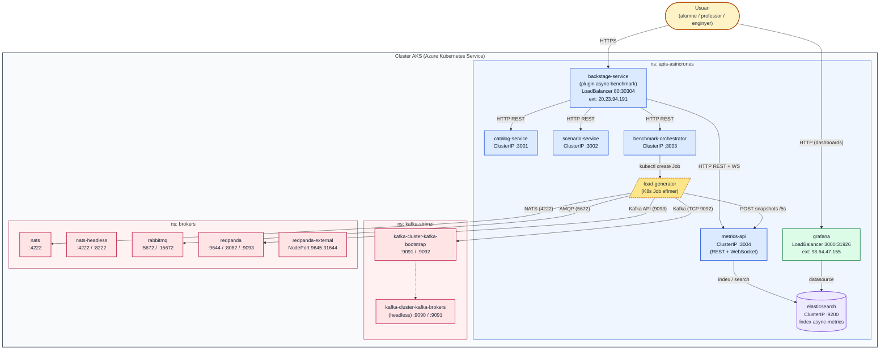

# APIs Asíncrones — Plataforma de Benchmark

Portal web (Backstage + plugin) i conjunt de microserveis per definir,
executar i analitzar **benchmarks d'APIs asíncrones** (Kafka, RabbitMQ,
NATS, Confluent...) sobre Azure Kubernetes Service (AKS).

> Projecte de Final de Grau · Universitat de Girona · Marc Font · 2026

---

## Què és això?

És una intranet d'aprenentatge i recerca on un alumne, professor o
enginyer pot:

1. **Triar una combinació** d'arquitectura + protocol + plataforma de
   missatgeria + format de dades.
2. **Llançar un benchmark real** contra el cluster AKS, sota la mateixa
   càrrega que totes les altres combinacions.
3. **Veure les mètriques en directe**: latència (P50/P99), throughput
   (msg/s), taxa d'error.
4. **Comparar** quina combinació funciona millor per cada cas d'ús.

---

## Arquitectura del sistema

El sistema viu dins un cluster **AKS** organitzat en tres _namespaces_ que aïllen
l'aplicació, el cluster Kafka gestionat per Strimzi, i la resta de brokers. El
fitxer font del diagrama es troba a [`docs/architecture.md`](docs/architecture.md).



### Components

- **Usuari** — accedeix al portal des del navegador. Punt d'entrada únic via IP pública del LoadBalancer (`20.23.94.191`).
- **backstage-service** (`ns: apis-asincrones`) — portal Backstage que serveix el plugin `async-benchmark` (Home, Catàleg, Escenaris, Execucions, Resultats). Exposat amb LoadBalancer `80:30304/TCP`.
- **catalog-service** (`:3001`) — CRUD del catàleg de components disponibles (arquitectures, protocols, plataformes, formats).
- **scenario-service** (`:3002`) — CRUD d'escenaris de benchmark (combinacions reutilitzables amb paràmetres de càrrega).
- **benchmark-orchestrator** (`:3003`) — converteix una petició `POST /runs` en un `Job` de Kubernetes que arrenca el `load-generator` dins un namespace efímer.
- **load-generator** (`Job` K8s) — container efímer que es connecta al broker triat, envia missatges sota un contracte just (fire-and-forget, payload determinista) i envia snapshots de mètriques cada 5s.
- **metrics-api** (`:3004`) — rep snapshots, els indexa a Elasticsearch i exposa REST (`/metrics`, `/metrics/summary`) i WebSocket per al directe.
- **elasticsearch** (`:9200`) — emmagatzematge de sèries temporals (índex `async-metrics`).
- **grafana** (`3000:31926`, ext `98.64.47.155`) — observabilitat operativa amb Elasticsearch com a datasource.
- **kafka-strimzi** — cluster Kafka gestionat per l'operador Strimzi (`bootstrap` per a clients, `brokers` headless per a coordinació interna).
- **brokers** — namespace que agrupa la resta de plataformes de missatgeria sota prova: **RabbitMQ** (AMQP), **NATS** (protocol propi), **Redpanda** (compatible amb l'API Kafka, també exposat com a NodePort per a accés extern).

---

## Estructura del repositori

```
apis-asincrones/
├── packages/                       # Microserveis i app Backstage
│   ├── app/                        # Frontend Backstage (React)
│   ├── backend/                    # Backend Backstage
│   ├── catalog-service/            # CRUD del catàleg de components
│   ├── scenario-service/           # CRUD d'escenaris de benchmark
│   ├── benchmark-orchestrator/     # Orquestra Jobs de K8s
│   ├── load-generator/             # Genera càrrega contra el broker
│   └── metrics-api/                # WebSocket + REST sobre Elasticsearch
├── plugins/
│   └── async-benchmark/            # Plugin Backstage amb les pàgines
│       └── src/
│           ├── pages/              # Home, Catàleg, Escenaris, Execucions, Resultats
│           ├── components/         # Components reutilitzables
│           └── shared/             # Helpers compartits
├── k8s/                            # Manifests Kubernetes
│   ├── deployments/                # ES, Grafana, microserveis
│   ├── services/                   # ClusterIPs i LoadBalancers
│   ├── storage/                    # PersistentVolumeClaims
│   ├── kafka/                      # Strimzi cluster Kafka
│   └── brokers/                    # ConfigMaps de NATS i altres
├── scripts/                        # Scripts auxiliars
├── deploy-all.sh                   # Pipeline de build + restart
└── app-config.yaml                 # Config Backstage (dev)
```

---

## Stack tecnològic

| Capa               | Tecnologia                       | Versió |
|--------------------|----------------------------------|--------|
| Frontend           | React + Backstage 1.47           | 18.x   |
| Backend            | Node.js + Express                | 22 o 24|
| Llenguatge         | TypeScript                       | 5.x    |
| Storage            | Elasticsearch                    | 8.12   |
| Cluster            | Azure Kubernetes Service (AKS)   | k8s 1.33 |
| Brokers            | Apache Kafka, RabbitMQ, NATS, Redpanda | varies |
| Operador Kafka     | Strimzi                          | 0.51.0 |
| Package manager    | Yarn                             | 4.4.1  |
| Tests              | Jest + Playwright                | varies |

---

## Engegada en local (mode desenvolupament)

### Prerrequisits

- Node.js 22 o 24
- Yarn 4.4.1 (s'instal·la sol via `corepack`)
- Git
- (Opcional) `kubectl` connectat a un cluster AKS si vols executar
  benchmarks reals; en cas contrari el frontend funciona sense problema
  i mostrarà escenaris desats però no pots llençar runs reals.

### Passos

```bash
git clone https://github.com/marcfontt/apis-asincrones.git
cd apis-asincrones
yarn install
yarn start
```

Això arrenca:

| Servei   | URL                        |
|----------|----------------------------|
| Frontend | http://localhost:3000      |
| Backend  | http://localhost:7007      |

Obre <http://localhost:3000> i navega a Home → Escenaris → Execucions → Resultats.

---

## Comandes útils

| Comanda                | Que fa                                        |
|------------------------|-----------------------------------------------|
| `yarn start`           | Arrenca frontend + backend en mode dev        |
| `yarn build:all`       | Compila tots els paquets                      |
| `yarn build:backend`   | Compila només el backend                      |
| `yarn test`            | Executa tests unitaris                        |
| `yarn test:e2e`        | Executa tests E2E (Playwright)                |
| `yarn lint:all`        | Linter a tot el projecte                      |
| `yarn prettier:check`  | Comprova format del codi                      |
| `yarn tsc`             | Type check TypeScript                         |
| `./deploy-all.sh`      | Pipeline complet: build + push + restart AKS  |

---

## Desplegament a AKS

El sistema està pensat per córrer dins un cluster AKS amb tots els
brokers pre-instal·lats. Els passos típics:

```bash
# 1. Aplica la infra (PVCs, Deployments, Services)
kubectl apply -f k8s/storage/
kubectl apply -f k8s/deployments/
kubectl apply -f k8s/services/
kubectl apply -f k8s/rbac/
kubectl apply -f k8s/brokers/

# 2. Build + push imatges + restart
./deploy-all.sh
```

Vegeu [`k8s/README.md`](k8s/README.md) per detalls.

---

## Conceptes que has d'entendre

Si arribes nou al projecte, comença per la pàgina **Home** del portal:
hi trobaràs una secció "Base conceptual" que explica de zero:

- API síncrona vs API asíncrona
- Què és una arquitectura, un protocol i una plataforma
- Què és la latència (P50, P99), el throughput i la taxa d'error
- Un diagrama del flux d'un missatge productor → broker → consumidor

---

## Estructura del codi (visió ràpida)

- **`packages/load-generator`** — quan l'orquestrador crea un Job a K8s,
  aquest container arrenca, es connecta al broker, envia missatges sota
  un contracte just (fire-and-forget, sense ACK del broker, payload
  determinista) i puja snapshots de mètriques cada 5s a `metrics-api`.
- **`packages/metrics-api`** — guarda cada snapshot a Elasticsearch
  (índex `async-metrics`) i serveix:
  - `GET /metrics?runId=X` → totes les mostres d'un run
  - `GET /metrics/summary` → agregació per run
  - WebSocket `/` → broadcast en directe als subscriptors
- **`packages/benchmark-orchestrator`** — converteix una crida `POST /runs`
  en un `kubectl create -f Job` aïllat dins un namespace efímer.
- **`plugins/async-benchmark`** — el plugin Backstage amb les 5 pàgines
  visibles: Home, Catàleg, Escenaris, Execucions, Resultats.

---

## Documentació addicional

- [`docs/architecture.md`](docs/architecture.md) — diagrama Mermaid de l'arquitectura i descripció de components
- [`k8s/README.md`](k8s/README.md) — manifests Kubernetes
- [`packages/README.md`](packages/README.md) — microserveis
- [`plugins/README.md`](plugins/README.md) — plugin Backstage

---

## Autoria

| Persona      | Rol                              |
|--------------|----------------------------------|
| Marc Font    | Estudiant / autor                |
| Jerónimo Hernández González | Tutor UdG          |
| David Teres Carrillo | Tutor empresa (NTT Data) |

Llicència: vegeu fitxer `LICENSE` (a afegir).
