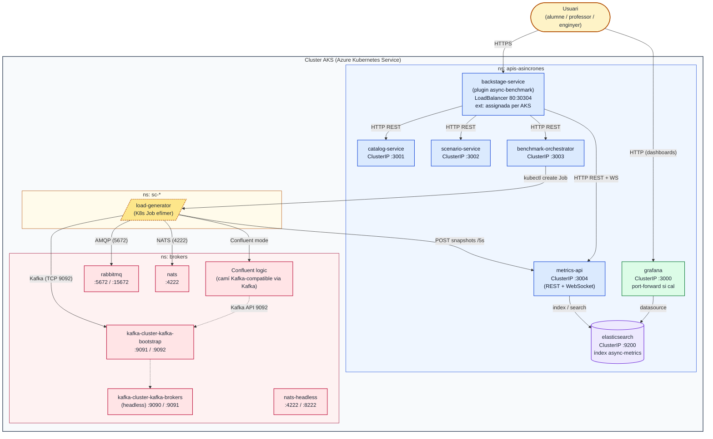

# Arquitectura del sistema — APIs Asíncrones (PFG)

Diagrama actualitzat amb els namespaces i serveis reals del cluster AKS.

---

## Visió general

El sistema s'organitza en **dos namespaces persistents** dins del cluster AKS,
mes els namespaces efímers `sc-*` que crea cada execució:

| Namespace | Contingut |
|-----------|-----------|
| `apis-asincrones` | Portal Backstage, microserveis i eines d'observabilitat |
| `brokers` | Kafka gestionat per Strimzi, NATS, RabbitMQ i Confluent pel camí Kafka-compatible |
| `sc-*` | Jobs efímers de benchmark, un namespace per run |

Unificar els brokers en `brokers` simplifica la reconstrucció del cluster
després del canvi de subscripció. La validesa de la comparació es defensa
amb recursos fixats, control de concurrència, warm-up i càrrega iguals, no amb
la separació física per namespace.

El flux principal és: **Usuari → Backstage → Orchestrator → Job (load-generator) → Broker → Metrics API → Elasticsearch**.

---

## Diagrama



---

## Components principals

### Namespace `apis-asincrones`

| Servei | Port | Exposició | Descripció |
|--------|------|-----------|------------|
| `backstage-service` | 80 → 30304 | LoadBalancer assignat per AKS | Portal Backstage amb el plugin `async-benchmark` |
| `catalog-service` | 3001 | ClusterIP | CRUD del catàleg de tecnologies |
| `scenario-service` | 3002 | ClusterIP | CRUD d'escenaris de benchmark |
| `benchmark-orchestrator` | 3003 | ClusterIP | Encola execucions i crea Jobs K8s respectant `MAX_CONCURRENT_RUNS` |
| `metrics-api` | 3004 | ClusterIP | REST + WebSocket sobre Elasticsearch |
| `elasticsearch` | 9200 | ClusterIP | Índex `async-metrics` (sèries temporals) |
| `grafana` | 3000 | ClusterIP | Dashboards d'observabilitat via port-forward quan cal |

### Namespace `brokers`

| Servei | Ports | Descripció |
|--------|-------|------------|
| `kafka-cluster-kafka-bootstrap` | 9091, 9092 | Punt d'entrada per a clients Kafka |
| `kafka-cluster-kafka-brokers` | 9090, 9091 | Servei headless per a coordinació interna |
| `nats` | 4222 | NATS Server (protocol NATS) |
| `nats-headless` | 4222, 8222 | Accés directe a pods + monitoratge HTTP |
| `rabbitmq` | 5672, 15672 | Broker AMQP + consola de gestió |
| Confluent logic | 9092 | En Azure for Students usa el mateix bootstrap Kafka-compatible de Strimzi si no es defineix `CONFLUENT_BROKERS`. |

### Namespaces `sc-*`

| Component | Vida | Descripció |
|-----------|------|------------|
| `load-generator` | Un Job per run | Envia càrrega al broker triat i puja snapshots cada 5 s a `metrics-api`. |
| Namespace `sc-<run>` | Efímer | Aïlla logs, variables d'entorn i cicle de vida de cada execució. |

---

## Flux d'una execució

```
1. Usuari crea un escenari al portal (Backstage)
2. Backstage crida l'orchestrator: POST /runs
3. L'orchestrator deixa el run en `pending` si el límit de concurrència està ple.
4. Quan hi ha espai, crea un Job de Kubernetes en un namespace efímer (sc-<slug>-<id>).
5. El Job arrenca el load-generator:
   - Es connecta al broker corresponent (Kafka, Confluent, RabbitMQ o NATS)
   - Envia missatges fire-and-forget amb payload determinista
   - Cada 5 s puja un snapshot de mètriques a metrics-api (POST /metrics)
6. metrics-api indexa el snapshot a Elasticsearch
7. El portal rep les mètriques via WebSocket en temps real
8. Quan l'execució finalitza, el Job es marca com "completed" i el namespace efímer s'esborra
```

## Concurrència i lectura dels estats

L'orquestrador no crea tots els Jobs alhora. Primer registra la petició i decideix
si pot entrar a Kubernetes:

| Estat | Significat |
|-------|------------|
| `pending` | El run està a la cua. Encara no hi ha Job ni mètriques. |
| `running` | El Job existeix i el generador està enviant mostres. |
| `completed` | La prova ha acabat i la mostra final s'ha guardat. |
| `failed` | El broker, el Job o el generador han fallat abans d'acabar. |
| `cancelled` | L'usuari ha aturat la prova manualment. |

Per a demo, `MAX_CONCURRENT_RUNS=3` permet avançar més ràpid sense saturar el
node de càrrega. Per a dades finals de memòria, el mode defensable és
`MAX_CONCURRENT_RUNS=1`, perquè evita que dues proves competeixin pels mateixos
recursos mentre es mesuren.

## Escenaris finals de mostra

La demo queda centrada en cinc presets, un per cada cas que es vol explicar:

| Cas | Preset | Broker / plataforma | Arquitectura | Protocol | Format |
|-----|--------|---------------------|--------------|----------|--------|
| IoT | `NATS telemetria IoT` | NATS Server | EDA | NATS | IoT |
| Vídeo 4K | `Kafka streaming 4K` | Kafka | SEA | Kafka | Vídeo 4K |
| Financer | `RabbitMQ financer fiable` | RabbitMQ | QBA | AMQP | Financer |
| Confluent | `Confluent streaming 4K` | Confluent pel camí Kafka-compatible | SEA | Kafka | Vídeo 4K |
| Kafka | `Kafka control base` | Kafka | EDA | Kafka | Base controlada |

El format `Vídeo 8K` continua disponible per provar payloads grans, però no és
el preset principal. Abans d'usar-lo com a resultat comparatiu cal validar
`message.max.bytes`, `replica.fetch.max.bytes`, `socket.request.max.bytes` i els
límits de fetch del consumidor.
